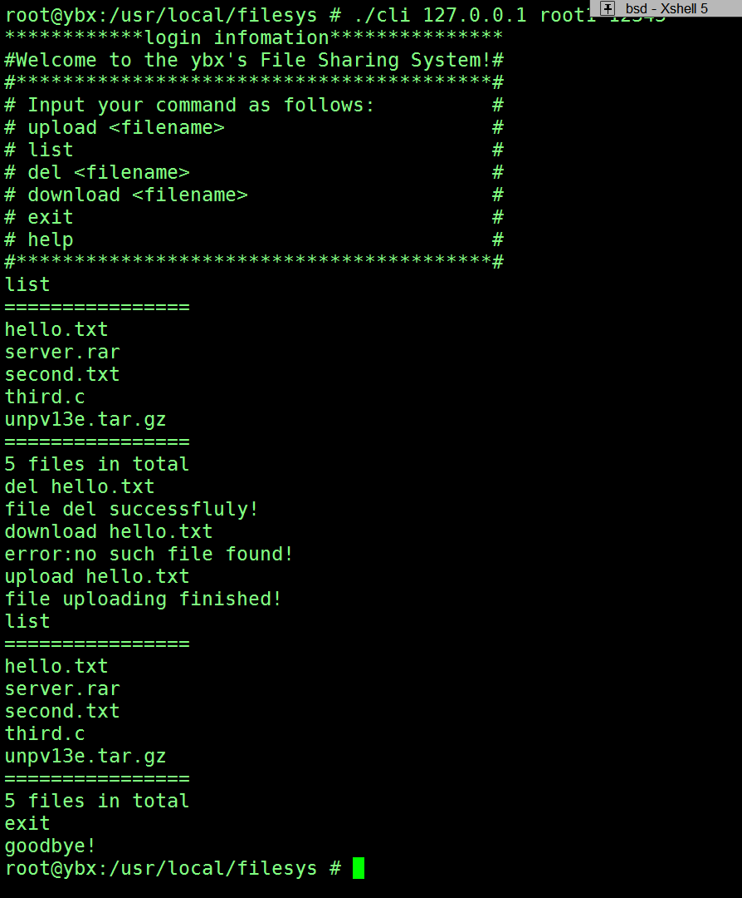

# 附加题 文件分享系统

## 功能要求

### 客户端
- 上传文件
- 显示文件列表
- 删除文件，仅可以删除用户自己上传的文件
- 下载文件

### 服务器端
文件存储在某个固定的文件夹下，根据客户端命令协助完成文件列表的显示
``` c
#include<unistd.h>
#include<dirent.h>
DIR *dir;//目录结构体
struct dirent *ptr;
dir = opendir("dirPath");//打开目录
ptr = readdir(dir);//读取目录
ptr->d_name;//遍历
//stat(ptr->d_name,stat *e)获取某个文件的详细信息
remove(filename);
```
## 实现

### 客户端
+ 将标准输入流中读到的命令使用字符串分割函数计算参数个数
+ 根据参数个数分类，再匹配字符串进入对应处理函数
+ 不同的命令将mode位置不同的数值，使用无符号整型数存储长度并write到sockfd中传输
+ 循环读取文件
### 服务端
+ 根据接收到的mode处理不同命令
+ 从网络sockfd中读取与从文件中读取不同，如果读取少于请求的size会阻塞等待数据，所以需要做不同处理
### 截图



