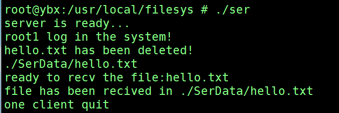

## 文件共享系统

### 客户端
+ 将标准输入流中读到的命令使用字符串分割函数计算参数个数
+ 根据参数个数分类，再匹配字符串进入对应处理函数
+ 不同的命令将mode位置不同的数值，使用无符号整型数存储长度并write到sockfd中传输
+ 循环读取文件
### 服务端
+ 根据接收到的mode处理不同命令
+ 从网络sockfd中读取与从文件中读取不同，如果读取少于请求的size会阻塞等待数据，所以需要做不同处理
### 截图

### 功能

缺少用户删除权限功能，实现想法：设置index数组标记用户id与client数组关联，在文件中设置用户id，然后封装一个函数通过比对判断权限
