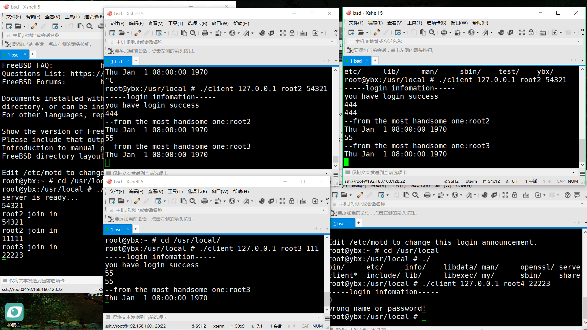

# Unix test上机作业2017/12/08
Unix Network Programming volume1

this is a simple chat room wrote in C Language by socket ( login through username and password )

## 概述
在FreeBSD 11.1环境下编写小型聊天室，使用cc编译，在服务端程序上使用select函数来支持并发访问，用户使用用户名和密码来登录，其中用户信息以数组形式简单存储在服务端程序上，
收到信息后进行匹配认证，通过后可以聊天，否则提示错误

## 实现
- 以命令行参数输入用户名密码
- 使用flag数组标识每个client的登录状态
- 使用封装的字符串函数

## 截图

## 改进
实现点对点传输

### 感想
程序不难但是费了不少时间，发现自己对于C语言中输入输出，字符串操作等许多函数实现不太了解，中间出现很多奇怪的bug，决定拾起C语言好好学一学。
